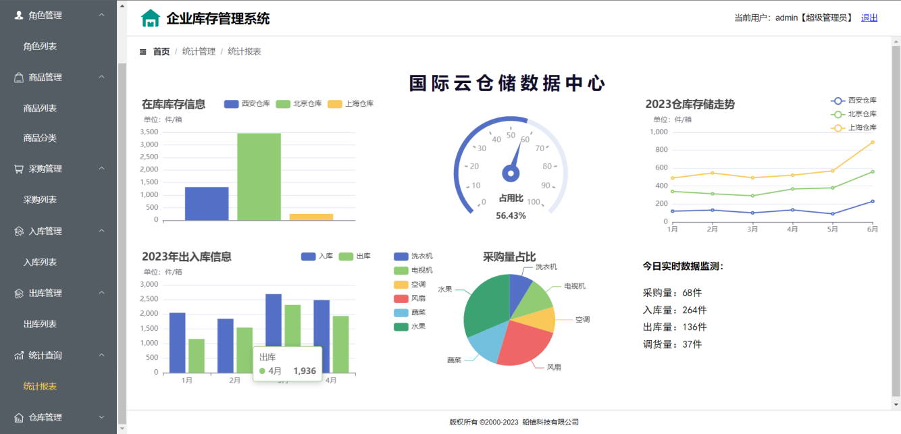

# 企业库存管理系统

在Springboot学习阶段，学习动力节点的练手项目

## 项目介绍

为满足日益扩大的仓库管理需求，对仓库中商品进销存进行统一管理，而开发了此系统。系统主要包含：

	RBAC:用户角色权限控制
	1>用户管理(查询用户、添加用户、修改用户、删除用户、导出数据、批量删除、禁用/启用用户、重置密码、分配角色、更改权限)
	2>角色管理(查询角色、添加角色、修改角色、删除角色、导出数据、禁用/启用角色、更改权限)
	3>权限管理(查询权限、添加权限、修改权限、删除角色、禁用/启用权限)
	
	4>商品管理(查询商品、添加商品、修改商品、商品审核等)
	5>商品分类管理(商品分类的添加、商品分类的查询、商品分类的修改、商品分类的删除等)
	6>采购管理(我的采购单、添加采购单、采购单的审核等)
	7>入库管理(入库单、保存入库单、确认入库等)
	8>出库管理(出库单、保存出库单、审核出库单等)
	9>统计管理(各个仓库库存信息、仓库占有比、仓库存储走势、出入库信息统计、采购量占比、实时数据监测)
	10>调货管理(调货单查询、确认调货)
	11>仓库管理(查询仓库、添加仓库、修改仓库、删除仓库、导出数据)
	12>供货商管理(供货商添加、供货商修改、供货商的查询等)
	13>品牌管理(品牌添加、品牌修改、品牌的查询等

## 技术选型

 SpringBoot + MyBatis + MySql + Redis + Vue3 + Axios + Element-Plus + Echarts等

## 示例图片

